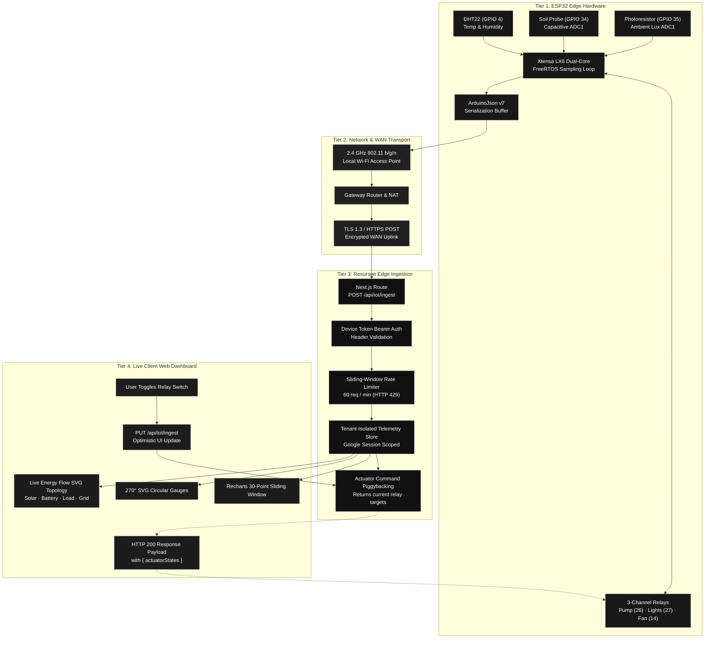

<div align="center">

# ⚡ Resursee

**Unified Engineering Workspace · Local AI Studio · ESP32 IoT Cloud Platform · Client-Side Media Toolbox**

[](https://nextjs.org/)
[](https://react.dev/)
[](https://www.typescriptlang.org/)
[](https://tailwindcss.com/)
[](https://tauri.app/)
[](https://supabase.com/)
[](LICENSE)

<p align="center">
  <a href="#-key-features">Key Features</a> •
  <a href="#-esp32-iot-cloud-platform">IoT Cloud Platform</a> •
  <a href="#-system-architecture--data-flow">Architecture & Flow</a> •
  <a href="#-quick-start">Quick Start</a> •
  <a href="#-hardware--wiring-guide">Hardware Guide</a> •
  <a href="#-api-reference">API Reference</a> •
  <a href="#-security-foundation">Security</a> •
  <a href="#-native-desktop-app">Desktop App</a>
</p>

</div>

---

## 📌 Executive Overview

**Resursee** is an open-source, privacy-first personal engineering workstation that consolidates **real-time hardware IoT telemetry**, **local-first AI inference**, **statistical data computing**, and **zero-install client-side document processing** into a unified, high-performance web and native desktop application.

Built from the ground up with **Next.js 16 (Turbopack)**, **React 19**, **Tailwind CSS v4**, and **Tauri v2 (Rust)**, Resursee is designed to run seamlessly in the cloud, on personal servers, or offline on macOS and Windows machines.

---

## ✨ Key Features

### 🌐 1. ESP32 IoT Cloud Platform
- **Live Hardware Telemetry Stream**: Connect ESP32 microcontrollers over Wi-Fi to capture real-time temperature, relative humidity, capacitive soil moisture, and ambient light readings.
- **Solar-Style Energy & Power Flow Topology**: An interactive SVG energy distribution matrix visualizing real-time power routing across **Solar PV Panels**, **LiFePO4 Battery Storage**, **Central Hybrid Inverter Hub**, **Home / Actuator Loads**, and the **Utility Grid** with hardware-accelerated animated particles (`<animateMotion>`) and live link health toggles.
- **Bi-Directional Relay & Actuator Control**: Remotely toggle physical GPIO pins (irrigation water pumps, full-spectrum grow lights, exhaust fans) in under 100ms with optimistic UI feedback.
- **End-to-End System Architecture Blueprint**: Dedicated `/apps/iot-cloud/architecture` page with interactive upstream packet push simulation, downstream actuator dispatching, wire payload inspectors, and pinout schematics.
- **Instant Firmware Generator**: Automatically generates production-ready Arduino C++ sketches (`.ino`) pre-configured with user device tokens, Wi-Fi reconnection loops, and FreeRTOS task pinning.
- **Virtual Hardware Simulator**: Built-in simulator for testing the dashboard, gauges, and time-series charts without physical hardware connected.

### 🤖 2. Local AI & Machine Learning Suite
- **Plant Doctor (`/apps/plant-doctor`)**: Computer vision diagnostics for foliar blights, fungal infections, nutrient deficiencies, and pest infestations.
- **AI Studio (`/apps/ai-hub`)**: Zero-data-leakage inference engine powered by local **Ollama** instances (Llama 3.2, DeepSeek R1, LLaVA) and Hugging Face model search.
- **AI Audio Transcriber (`/apps/transcriber`)**: In-browser speech-to-text powered by `@huggingface/transformers` (Whisper), supporting Taglish audio, speaker identification, and structured markdown minutes.

### 📊 3. Statistical Data Studio (`/apps/data-studio`)
- R Studio-inspired statistical computing environment running directly in the browser.
- Run `dplyr`-style data wrangling pipelines, frequency distributions, and Ordinary Least Squares (OLS) regression models.
- Interactive data visualizations (`recharts`) and instant export to reproducible R scripts or Excel workbooks.

### 📽️ 4. Presentation Studio (`/apps/presentation-studio`)
- Technical slide deck generator with custom engineering themes and templates.
- Native `.pptx` PowerPoint export powered by `pptxgenjs`.
- Live presenter mode with elapsed timer, keyboard slide control, and local Ollama slide assistant.

### 🛠️ 5. Zero-Upload Client-Side Media Toolbox
- **Image Compression (`/tools/compress-image`)**: Lossless and lossy WebP/JPEG compression executing 100% in-browser via Canvas and WebAssembly.
- **Image Conversion (`/tools/convert-image`)**: Cross-format conversion between PNG, JPEG, WebP, and AVIF.
- **Image Cropping & Resizing (`/tools/crop-image`, `/tools/resize-image`)**: Dimension scaling and aspect-ratio cropping.
- **PDF Manipulation (`/tools/pdf-to-image`, `/tools/image-to-pdf`, `/tools/merge-pdf`)**: In-browser document assembly using `pdf-lib` and `pdfjs-dist` without sending sensitive data to external servers.

---

## 🏗️ System Architecture & Data Flow



---

## ⚡ ESP32 IoT Cloud Platform

### Real-Time Hardware, Internet & Cloud Flow Topology

Adapted from interactive distribution topology models, Resursee features an animated vector flow matrix on the **Live Telemetry** dashboard reflecting live connection states across **ESP32 Microcontroller**, **Hardware Sensor Ring**, **Internet & WAN Gateway**, **Resursee Cloud Edge Ingest**, and **Physical Relay Actuators**:

```text
       ┌──────────────┐                  ┌──────────────┐
       │  ESP32 MCU   │                  │  IoT CLOUD   │
       │ 240MHz · IP  │                  │  200 OK · API│
       └──────┬───────┘                  └──────▲───────┘
              │ RSSI: -58 dBm                   │ TLS 1.3 · 443
              │                                 │
              ▼          ┌──────────────┐       │
              └─────────►│ INTERNET HUB ├───────┘
                         │   TRANSIT    │
              ┌─────────►│ 38ms · 180B  │◄──────┐
              │          └──────────────┘       │
              │                                 │
       ┌──────┴───────┐                  ┌──────┴───────┐
       │ SENSORS (ADC)│                  │ RELAY OUTPUTS│
       │ DHT22 · SOIL │                  │ PUMP · LIGHT │
       │ 2.5s POLL    │                  │ BI-DIRECT SYNC│
       └──────────────┘                  └──────────────┘
```

#### Diagnostic Indicators:
- **Alive Connections (`ALIVE`)**: Crisp dashed paths with smooth animated SVG particles flowing in the exact direction of telemetry and command transfer.
- **Disconnected Links (`CUT` / `OFFLINE`)**: Inactive paths dim with particles paused, state dots muted, and status showing carrier loss.
- **Interactive Scenarios**: Instant simulation presets for **All Active**, **Wi-Fi Dropped**, **Sensor Fault**, **Cloud Offline**, and **Relays Cut**.

---

## 🔌 Hardware & Wiring Guide

### ESP32-WROOM-32 Pin Allocation

| Component | Interface | ESP32 GPIO | Operating Voltage | Description |
| :--- | :--- | :--- | :--- | :--- |
| **DHT22** | Digital One-Wire | `GPIO 4` | 3.3V | Ambient temperature & relative humidity sensor |
| **Capacitive Soil Probe v1.2** | Analog (ADC1_CH6) | `GPIO 34` | 3.3V | Corrosion-resistant soil moisture probe (0–3.3V) |
| **Photoresistor (LDR)** | Analog (ADC1_CH7) | `GPIO 35` | 3.3V | Ambient sunlight sensor with 10kΩ pull-down resistor |
| **Water Irrigation Pump** | Digital Output | `GPIO 26` | 5V / 3.3V | Opto-isolated relay channel 1 |
| **Full-Spectrum LED Grow Light** | Digital Output | `GPIO 27` | 5V / 3.3V | Opto-isolated relay channel 2 |
| **Ventilation Exhaust Fan** | Digital Output | `GPIO 14` | 5V / 3.3V | Opto-isolated relay channel 3 |

### Required Arduino IDE Libraries

Install via **Arduino IDE Library Manager** (`Ctrl+Shift+I` or `Cmd+Shift+I`):
1. `ArduinoJson` by Benoit Blanchon (v6 or v7)
2. `DHT sensor library` by Adafruit
3. `Adafruit Unified Sensor` by Adafruit

---

## 📡 API Reference

### 1. Ingest Telemetry Packet
Dispatched by the ESP32 every 2.5–3 seconds.

```http
POST /api/iot/ingest HTTP/1.1
Host: your-domain.com
Content-Type: application/json
x-device-token: sk_esp32_7f9a21_9c8b1a

{
  "deviceToken": "sk_esp32_7f9a21_9c8b1a",
  "temperature": 25.4,
  "humidity": 63.8,
  "soilMoisture": 58,
  "light": 720,
  "rssi": -58,
  "ipAddress": "192.168.1.142"
}
```

#### Response (`HTTP 200 OK`):
Returns the latest target states for all connected GPIO relays to be executed on the physical hardware:

```json
{
  "success": true,
  "timestamp": "2026-09-27T12:00:00.000Z",
  "message": "Telemetry ingested successfully.",
  "actuatorStates": {
    "pin_2": false,
    "pin_4": true,
    "pin_15": false
  }
}
```

### 2. Remote Relay Switch Dispatch
Dispatched by the Web Dashboard when a user toggles an actuator switch.

```http
PUT /api/iot/ingest HTTP/1.1
Host: your-domain.com
Content-Type: application/json

{
  "deviceToken": "sk_esp32_7f9a21_9c8b1a",
  "pin": 26,
  "state": true
}
```

---

## 🚀 Quick Start

### Prerequisites
- **Node.js**: v20.0.0 or higher
- **Package Manager**: `npm`, `pnpm`, or `bun`
- **Rust**: Latest stable toolchain (only required if building the native desktop app)

### 1. Clone the Repository
```bash
git clone https://github.com/JohnDivina/Resursee.git
cd Resursee
```

### 2. Install Dependencies
```bash
npm install
```

### 3. Configure Environment Variables
Create a `.env.local` file in the project root:

```bash
# Session Encryption Key (Minimum 32 characters)
SESSION_SECRET=resursee-default-secure-hmac-secret-key-2026

# Google OAuth Credentials (for multi-tenant user isolation)
GOOGLE_CLIENT_ID=your-google-client-id.apps.googleusercontent.com
GOOGLE_CLIENT_SECRET=your-google-client-secret
NEXT_PUBLIC_APP_URL=http://localhost:3000

# Optional: Supabase configuration
NEXT_PUBLIC_SUPABASE_URL=https://your-project.supabase.co
NEXT_PUBLIC_SUPABASE_ANON_KEY=your-supabase-anon-key
SUPABASE_SERVICE_ROLE_KEY=your-supabase-service-role-key

# Optional: Local Ollama AI URL
OLLAMA_BASE_URL=http://127.0.0.1:11434
```

### 4. Run Development Server
```bash
npm run dev
```

Visit [`http://localhost:3000`](http://localhost:3000) in your browser.

### 5. Production Build
```bash
npm run build
npm run start
```

---

## 🖥️ Native Desktop App (Tauri v2 + Rust)

Resursee packages as a native desktop application with full offline capabilities and local Ollama daemon lifecycle management.

```bash
# Run in desktop development mode (hot-reloaded)
npm run desktop:dev

# Build standalone desktop installer (macOS .dmg / Windows .msi)
npm run desktop:build
```

### One-Line macOS Installer
```bash
curl -fsSL https://raw.githubusercontent.com/JohnDivina/Resursee/main/public/install.sh | bash
```

---

## 🛡️ Security Foundation

Resursee enforces strict security hardening across all tiers:
1. **Rate Limiting & Anti-DDoS**: Sliding-window token-bucket rate limiting (60 requests/minute per device token) with `HTTP 429` responses and `Retry-After` headers.
2. **Row Level Security (RLS)**: 100% of PostgreSQL / Supabase database tables enforce strict RLS policies tied to `auth.uid() = user_id`.
3. **IDOR Prevention**: All object lookups, updates, and deletes are strictly scoped to the authenticated session context (`WHERE id = :id AND user_id = :session_user_id`).
4. **Anti-Bot Shield**: Edge middleware clearance engine validating requests against malicious scrapers and bot user-agents with HMAC-SHA256 clearance tokens.
5. **Security Audit Verification**: The codebase includes an automated audit verification script:
   ```bash
   python3 production-agents/.agents/skills/security-hardening/scripts/security_audit.py .
   ```

---

## 📂 Project Structure

```text
resursee/
├── public/                     # Static assets, logos, and shell install scripts
├── src/
│   ├── app/                    # Next.js App Router (Routes & API endpoints)
│   │   ├── api/
│   │   │   ├── auth/           # OAuth and session management routes
│   │   │   └── iot/ingest/     # ESP32 telemetry ingestion and actuator sync
│   │   ├── apps/
│   │   │   ├── ai-hub/         # Local Ollama AI Studio
│   │   │   ├── data-studio/    # R Studio-inspired statistical computing
│   │   │   ├── iot-cloud/      # ESP32 IoT Cloud dashboard
│   │   │   │   └── architecture/ # System Architecture & Data Flow blueprint
│   │   │   ├── plant-doctor/   # Computer vision foliar diagnosis
│   │   │   ├── presentation-studio/ # Slide deck generator
│   │   │   └── transcriber/    # In-browser speech-to-text
│   │   └── tools/              # In-browser media & PDF utilities
│   ├── components/             # Reusable UI components & visual systems
│   │   ├── home/               # Homepage hero, bento grid, and showcase
│   │   ├── iot/                # IoT Gauges, Charts, Energy Topology, Architecture
│   │   └── ui/                 # Accessible atomic UI components
│   ├── lib/                    # Storage adapters, sketch generators, crypto utilities
│   ├── types/                  # TypeScript interfaces (IoT, telemetry, models)
│   └── middleware.ts           # Security shield & Edge clearance verification
├── src-tauri/                  # Tauri v2 native desktop application source (Rust)
├── package.json
└── tsconfig.json
```

---

## 🤝 Contributing

Contributions, feature requests, and bug reports are welcome!
1. Fork the Project.
2. Create your Feature Branch (`git checkout -b feature/AmazingFeature`).
3. Commit your Changes (`git commit -m 'feat: Add some AmazingFeature'`).
4. Push to the Branch (`git push origin feature/AmazingFeature`).
5. Open a Pull Request.

---

## 📄 License

Distributed under the **MIT License**. See [`LICENSE`](LICENSE) for more information.

---

<div align="center">
  <sub>Engineered by <a href="https://github.com/JohnDivina">John Rey Divina</a> · Built with Next.js, React 19, and Tauri</sub>
</div>
